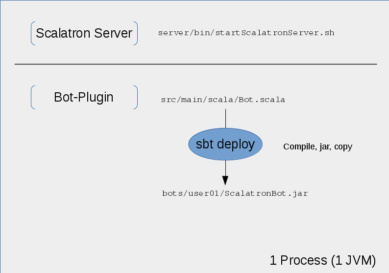

# [Scalatron](http://scalatron.github.io/) Bot Development

## Overview

The Scalatron Server picks up bot-plugin-jars.
The Bot, we will develop in this workshop, is expected as `bots/user01/ScalatronBot.jar`.



We will use `sbt` to generate the `.jar` file from the `.scala`-source(s).

## Preconditions

Installed Scala Build Tool [sbt](http://www.scala-sbt.org/)

## Initialization of the Environment

With `SCD_HOME` as root directory of this project: 

```bash

    $ cd $SCD_HOME
    $ sbt deploy
```    

## Start the Scalatron Server

```bash

    $ cd $SCD_HOME/server/bin
    $ ./startScalatronServer.sh 
        STARTING SCALATRON : ./../..
        Listening for transport dt_socket at address: 5005
        ...
        Keyboard commands available in the display window:
         '1'   -- no delay between simulation steps
         '2'   -- delay = 50ms
         '3'   -- delay = 100ms
         '4'   -- delay = 250ms
         '5'   -- delay = 500ms
         '6'   -- delay = 1000ms
         '7'   -- delay = 2000ms
         space -- freeze/unfreeze the action
         'h'   -- show/hide bot horizons
         'r'   -- abort round, rescan for updated plug-ins and start next round
         '+/-' -- step through players

```
A gameboard should appear. Play with the Keyboard commands ...

# Develop your Bot

```

    $ cd $SCD_HOME
    $ sbt
    > ~deploy  //sbt listens for code changes and automatically deploys them   
```

Open `$SCD_HOME/src/main/scala/Bot.scala` and change the response of the `ControlFunction` to "Hello World".
Check on the gameboard, that the response text in fact changed. If not, press 'r' on the gameboard and check again.

# References

- [Serious Path Setup](https://github.com/scalatron/scalatron/blob/master/Scalatron/doc/markdown/Scalatron%20Player%20Setup.md#the-serious-path-building-locally)

- [Scalatron Game Rules](https://github.com/plipp/scalatron/blob/master/Scalatron/doc/markdown/Scalatron%20Game%20Rules.md)
- [Scalatron Game Protocol](https://github.com/plipp/scalatron/blob/master/Scalatron/doc/markdown/Scalatron%20Protocol.md)


