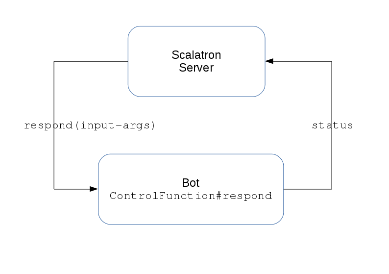

# Get Your First Bot Running

1. Open [the Bot Code File](../../src/main/scala/Bot.scala)
2. Deploy it on the gameboard as described in the [Bot-Development readme](../bot-development/readme.md)
3. The Scalatron Server and the Bot communicate as follows: 
   
   
   Change the response of the `ControlFunction` to "Hello World".
   Check on the gameboard, that the response text in fact changed. If not, press 'r' on the gameboard and check again.