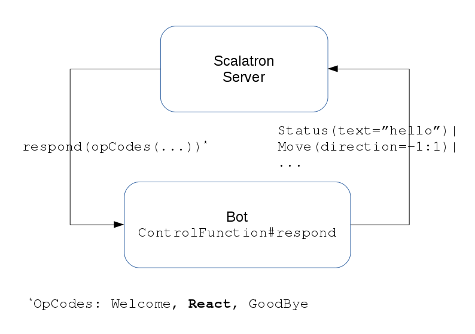

# Understand Control Function Input

## Motivation
`respond(input: String)` gets input-strings which represent operation codes with details, e.g. 
`"React(generation=0,time=0,view=__W_W_W__,energy=100)", "Goodbye(energy=0)"...`
  

see [Scalatron Game Protocol](https://github.com/plipp/scalatron/blob/master/Scalatron/doc/markdown/Scalatron%20Protocol.md#control-function-protocol)
for further details.

To react appropriately on an input string, we need to decompose the input string.
  
## Instructions

1. Work through the worksheets
    - [if](../../src/main/worksheets/03_01_if.sc)
    - [strings-1](../../src/main/worksheets/03_02-1-strings.sc)
    - [strings-2](../../src/main/worksheets/03_02-2-strings.sc)
2. Enhance your Bot
    - In case of a 'React' as input state (e.g. React(generation=0,time=0,view=__W_W_W__,energy=100)) 
      let your Bot 
      - [move](https://github.com/plipp/scalatron/blob/master/Scalatron/doc/markdown/Scalatron%20Protocol.md#movedirectionintint)
      1 UP 
      - [Optional] print your energy-status, e.g.: 'Status(text="50")'
    - If there is no 'React'-input, but anything else: return ""