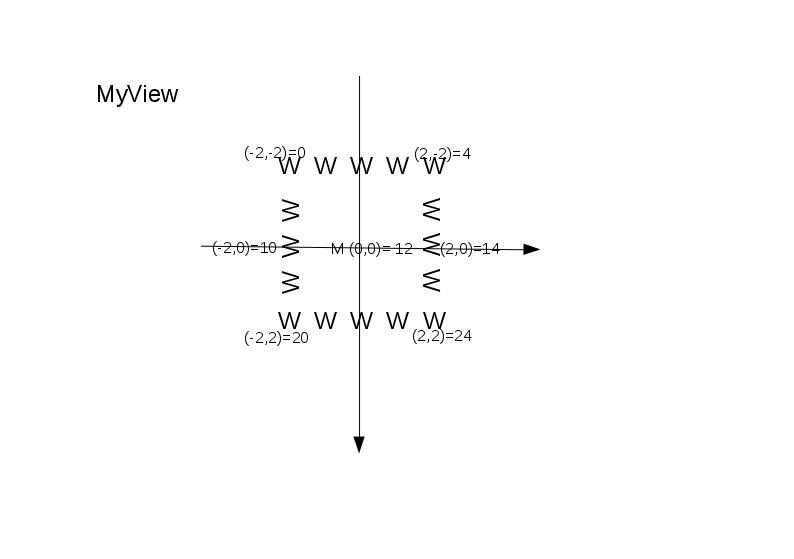
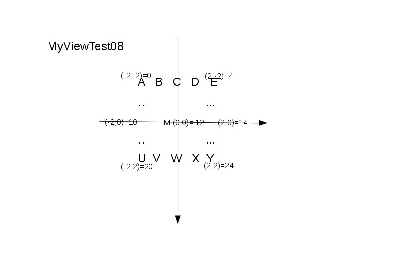

# Find a Path

Lets make our bot more intelligent: It shouldn't run into a wall any more and it should always be in motion.

**How do we achieve this?**

`React`gives us a *view* of the surrounding environment, e.g <br>
```
val view =  "WWWWWW   WW   WW   WWWWWW"
```
According to the Scalatron Protocol, the number of rows of the *view* is always equal to number of columns (`r == c` ), 
thus `r x c` is quadratic. The bot (**M**) itself is always in the **middle** of the view.

Thus the view is equal to:
```
val view =  "WWWWW"+
            "W   W"+
            "W M W"+
            "W   W"+
            "WWWWW"+
```

We now have to interpret the *view* and to react accordingly.

To be able to work easier with [moves](./images/Move-Direction.png), we introduce a **bot-centric** coordinate system:<br>
<br>
and check, whether a [move](./images/Move-Direction.png) is possible or not.

## Instructions

1. Starting point:
   [08-Bot-Starter.scala](snippets/08-Bot-Starter.scala): You may want to copy it to [the actual Bot.scala file](../../src/main/scala/Bot.scala)

2. Decomment the Tests in [MyViewTest08](../../src/test/scala/MyViewTest08.scala) and<br>
   Implement [Bot.scala: MyView#toIndex](../../src/main/scala/Bot.scala):<br> 
   It should transform (x,y)-coordinates to the index of the char (figure) in the *view* string, which `React` passes. 
   
   The view, the bot has is like this one:<br>
    <br>
   
   When finished, check, that the tests are green.
   
3. Work through the worksheets
    - [more-for](../../src/main/worksheets/08_01-more-for.sc)
    - [for-comprehensions](../../src/main/worksheets/08_01-for-comprehensions.sc)
                 
4. Implement [Bot.scala: PathFinder#findPath](../../src/main/scala/Bot.scala), so that the bot does not crash in a wall
   'W' and is always in motion.

5. Check, that the tests still work. If necessary adapt them.